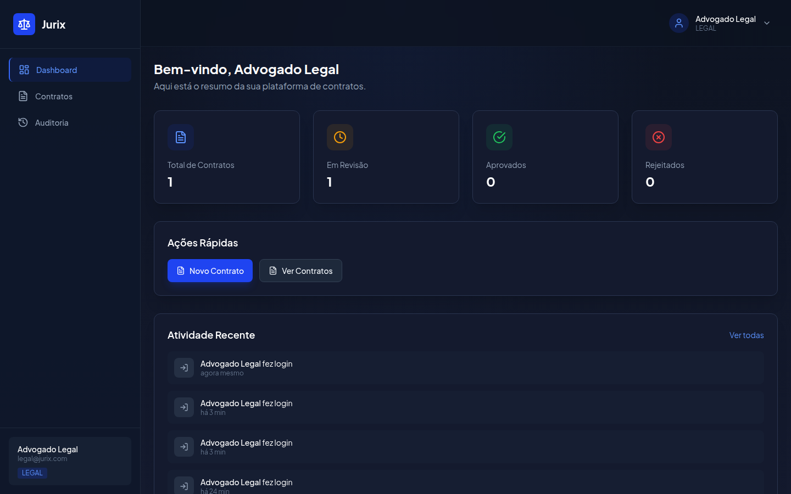
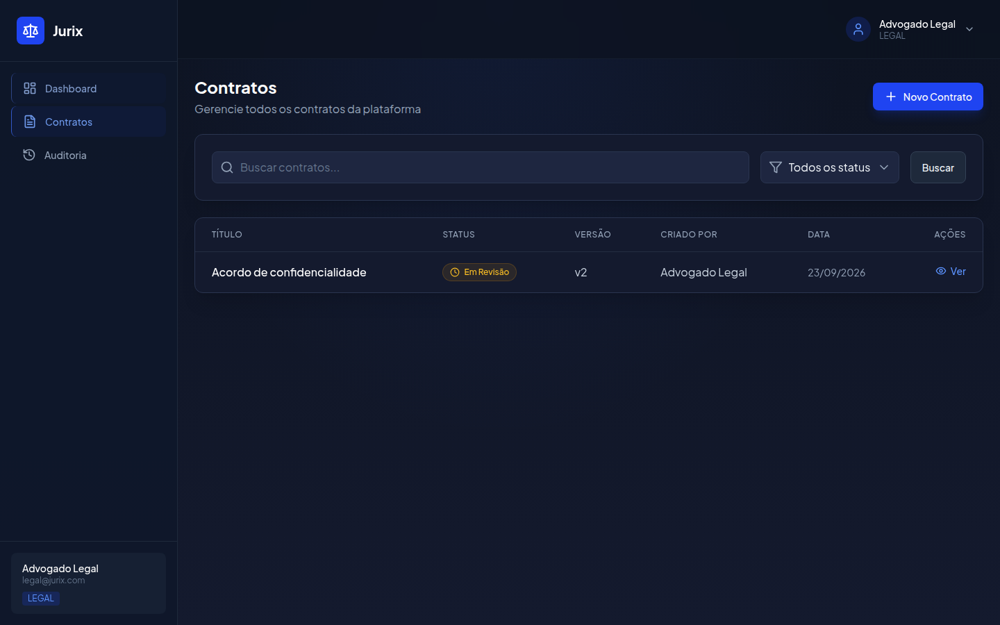
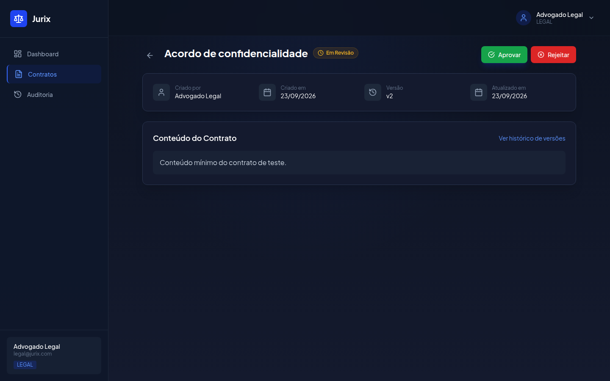

# Jurix

[Português](README.pt-BR.md)

[](https://github.com/victor-dias-dev/Jurix/actions/workflows/ci.yml)
[](LICENSE)


Corporate contract workflow: a fixed status machine, an immutable version for every change, and an audit row written in the same database transaction as the change.

`DRAFT` goes to `IN_REVIEW`, then to `APPROVED` or `REJECTED`. `REJECTED` can return to `DRAFT`. A viewer cannot read drafts. An approved contract cannot be edited or deleted. This is not a full legal suite: there is no real single sign-on, no digital signature, and no clause library.





## What is in the app

- Login with three roles: ADMIN, LEGAL, and VIEWER
- Contracts: create, edit, submit, approve, reject, and return to draft
- Immutable versions and an audit log
- User administration
- PDF export of a contract

## Requirements

- Node.js 20+
- pnpm 10+
- Docker and Docker Compose

## Quick start

```bash
pnpm install
cp .env.example .env
docker compose up -d
pnpm db:migrate
pnpm db:seed
pnpm dev
```

Seed users: `admin@jurix.com` / `Admin@123`, `legal@jurix.com` / `Legal@123`, `viewer@jurix.com` / `Viewer@123`.

`pnpm dev` starts the NestJS API and the Next.js app. Separately: `pnpm dev:backend` and `pnpm dev:frontend`.

App: http://localhost:3000. API prefix: `/api`. Health: `GET /api/health`.

The API refuses to boot when `JWT_SECRET` or `JWT_REFRESH_SECRET` is missing. Copy the example and keep real secrets out of git. Compose publishes Postgres on host port `5433`.

Optional pgAdmin: `docker compose --profile tools up -d`, then http://localhost:5050 (`admin@jurix.local` / `admin123`).

| Variable | Purpose |
| --- | --- |
| `NODE_ENV` | `development`, `test`, or `production` |
| `PORT` | API port (`3001`) |
| `DB_HOST` | PostgreSQL host |
| `DB_PORT` | PostgreSQL port (`5433` with Compose) |
| `DB_USERNAME` | Database user |
| `DB_PASSWORD` | Database password |
| `DB_DATABASE` | Database name |
| `JWT_SECRET` | Access token secret. Required |
| `JWT_EXPIRES_IN` | Access token lifetime (`15m`) |
| `JWT_REFRESH_SECRET` | Refresh token secret. Required |
| `JWT_REFRESH_EXPIRES_IN` | Refresh token lifetime (`7d`) |
| `CORS_ORIGIN` | Allowed browser origin |
| `NEXT_PUBLIC_API_URL` | API origin, without `/api` (`http://localhost:3001`) |

## Checks

```bash
pnpm test
pnpm --filter @jurix/backend test:e2e
pnpm lint
pnpm build
```

End-to-end tests need PostgreSQL with the variables from `.env.example`.

## Repository

```text
apps/backend        NestJS REST API
apps/frontend       Next.js 14
packages/shared-types  Roles, status machine, permission helpers
```

Business rules: [rules-documentation.md](rules-documentation.md). Technical notes: [tech-documentation.md](tech-documentation.md). Decisions: [docs/adr](docs/adr/001-zod-at-the-api-boundary.md). Why versions exist: [docs/blog/contract-approval-without-losing-history.md](docs/blog/contract-approval-without-losing-history.md).

## Contributing

See [CONTRIBUTING.md](CONTRIBUTING.md). Security reports go through [private vulnerability reporting](https://github.com/victor-dias-dev/Jurix/security/advisories/new), described in [SECURITY.md](SECURITY.md).

Licensed under the [MIT License](LICENSE).
