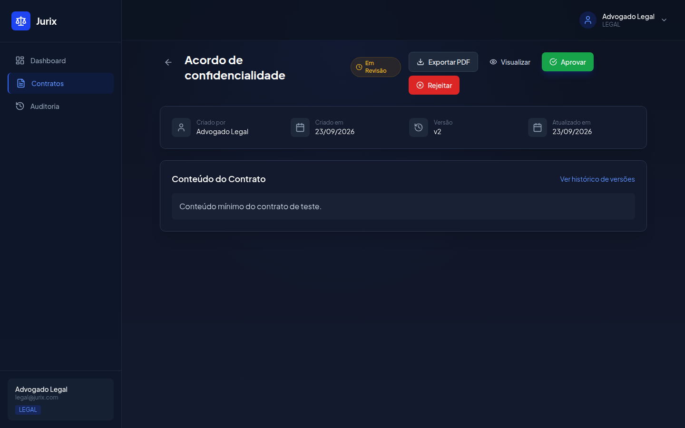

# Jurix

[](https://github.com/victor-dias-dev/Jurix/actions/workflows/ci.yml)

O Jurix é uma implementação de referência de workflow de contratos. O contrato percorre uma máquina de estados fixa, cada mudança vira uma versão imutável, e o registro de auditoria é gravado na mesma transação do banco que a mudança.

Serve para quem quer ler, rodar e estender esse fluxo. Não é uma suíte jurídica: não há SSO real, nem assinatura digital, nem biblioteca de cláusulas.

[English](../../README.md) · [Regras de negócio](../../rules-documentation.md) · [Notas técnicas](../../tech-documentation.md) · [Decisões](../adr/001-zod-at-the-api-boundary.md) · [Por que a versão existe](blog/aprovacao-de-contrato-sem-perder-historico.md)

## Fluxo

```
DRAFT → IN_REVIEW → APPROVED
                 ↘ REJECTED → DRAFT
```

Quem tem o papel VIEWER lê tudo, menos rascunho. Edição só em `DRAFT` e `REJECTED`. Contrato aprovado não pode ser excluído.



## Stack

| App | Papel |
| --- | --- |
| `apps/backend` | API NestJS, PostgreSQL, Sequelize no runtime, Knex nas migrations |
| `apps/frontend` | Next.js 14, Tailwind, Zustand |
| `packages/shared-types` | Papéis, transições de status, permissões |

## Como subir

Requisitos: Node.js 20+, pnpm 10+, Docker.

```bash
git clone https://github.com/victor-dias-dev/Jurix
cd Jurix
pnpm install
cp .env.example .env
docker compose up -d
pnpm db:migrate && pnpm db:seed
pnpm dev
```

- App: http://localhost:3000
- API: http://localhost:3001/api
- pgAdmin opcional: `docker compose --profile tools up -d`, depois http://localhost:5050 (`admin@jurix.local` / `admin123`)

A API lê `DB_HOST`, `DB_PORT`, `DB_USERNAME`, `DB_PASSWORD` e `DB_DATABASE`. O Compose publica o Postgres na porta **5433** do host. O processo não sobe sem `JWT_SECRET` e `JWT_REFRESH_SECRET`.

### Contas de demonstração

Esses usuários só existem depois de `pnpm db:seed` num banco local.

| Papel | Email | Senha |
| --- | --- | --- |
| ADMIN | admin@jurix.com | Admin@123 |
| LEGAL | legal@jurix.com | Legal@123 |
| VIEWER | viewer@jurix.com | Viewer@123 |

## Verificação

```bash
pnpm lint
pnpm test
pnpm --filter @jurix/backend test:e2e
pnpm build
```

## Roteiro

1. OpenAPI gerada a partir dos schemas Zod, começando pelo módulo de auth.
2. Limite de taxa em `POST /api/auth/login`.
3. Trigger no Postgres que recusa `UPDATE` e `DELETE` em `audit_logs`.

Os três itens também estão em [CONTRIBUTING.md](../../CONTRIBUTING.md).

## Licença

[MIT](../../LICENSE) © victor-dias-dev
